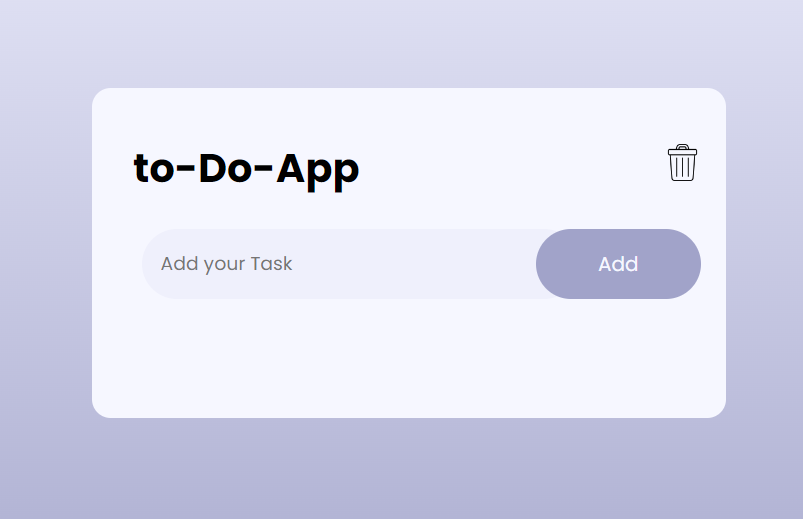

<h1>Taskify - Your Ultimate Task Management Companion 🚀</h1>

  

Welcome to Taskify, your trusted co-pilot in the journey of productivity! Taskify is more than just a to-do list – it's your sidekick in conquering tasks, achieving goals, and unlocking your full potential. Strap in and embark on an adventure of efficiency and organization with Taskify!

<h2>Features 🌟</h2>
Seamless Task Management: Effortlessly add, complete, and remove tasks to streamline your workflow.

Intuitive Interface: User-friendly design for an intuitive task management experience.

Task Persistence: Your tasks are securely stored in your browser's local storage, ensuring they stay with you even after closing the tab.

<h2>Usage 🚀</h2>
Add Your Tasks: Enter your tasks in the input field and hit Enter or click "Add" to add them to your list.

Conquer Your Tasks: Click on a task to mark it as completed and watch as Taskify cheers you on with every victory!

Remove Tasks: Bid farewell to completed tasks by clicking the trash icon next to them – declutter your list and make room for new accomplishments.

<h2>Get Started 🎉</h2>
Ready to unleash your productivity superpowers? Launch Taskify and start dominating your to-do list like never before!

<h2>Contributing 🤝</h2>
Whether you spot a bug, have a brilliant feature idea, or want to contribute code improvements, we welcome your contributions with open arms. Create an issue or submit a pull request.

<h2>License 📄</h2>
This project is licensed under the MIT License – feel free to explore, customize, and share Taskify with the world!
